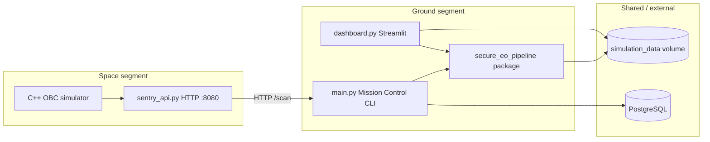

# Sentry-Ground Zero — Encyclopedia & Operator Manual

This document is the **primary reference** for the project. It is written so that a reader with **no prior context** can understand **what the system does**, **why each major choice exists**, **where it lives in code**, and **what the trade-offs are**. It combines **theory** (security and systems thinking) with **practice** (commands, files, and runtime behavior).

For even deeper, service-local detail, see also:

- `services/ground-segment/README.md` — ground-segment security pipeline manual  
- `services/space-segment/README.md` — space-segment OBC / ML toolchain manual  

---

## How to read this manual

| If you want to… | Read… |
|-----------------|--------|
| Run the full stack quickly | [Quick start (Docker)](#quick-start-docker) |
| Understand the big picture | [System goals](#system-goals-and-non-goals), [Architecture](#system-architecture) |
| Learn security reasoning | [Threat model](#threat-model), [Defense in depth](#defense-in-depth-theory-and-what-we-implement) |
| Navigate the codebase | [Repository layout](#repository-layout), [Ground segment module map](#ground-segment-code-map), [Space segment module map](#space-segment-code-map) |
| Operate Mission Control | [CLI and lifecycle](#mission-control-cli-and-data-lifecycle) |
| Understand Docker | [Container topology](#container-topology-docker-compose) |
| See trade-offs | [Design decisions (pros/cons)](#design-decisions-with-pros-and-cons) |

---

## System goals and non-goals

### Goals (what we optimize for)

1. **Pedagogy** — Every layer (space simulator, ground pipeline, dashboard) is readable and commented so you can connect **policy** to **mechanism**.
2. **End-to-end coherence** — One story from “sensor tile in orbit” to “operator console + optional UI,” without external mission hardware.
3. **Security engineering patterns** — Trust zones, RBAC, auditability, integrity (hashing), confidentiality (encryption at rest), resilience (backup/restore), and detection (IDS-style log analysis).
4. **Reproducibility** — Docker images and a root `Makefile` so builds and demos work on typical developer machines.

### Non-goals (what this is *not*)

| Non-goal | Why |
|----------|-----|
| Production flight software | No RTOS, no real bus protocols, no radiation model. |
| Cryptographic certification | Keys are files; PUF is simulated; MAC may be dummy in some builds. |
| Scientific publishing fidelity | Physics checks are **illustrative thresholds** on synthetic arrays, not peer-reviewed retrieval algorithms. |
| Cloud-scale performance | Single-machine simulation; PostgreSQL is used as a **sidecar** for persistence in Compose, not as a full multi-tenant platform. |

---

## Glossary

| Term | Meaning here |
|------|----------------|
| **Space segment** | Simulated satellite OBC: C++ loop, optional ML inference, signed/CCSDS-style telemetry emission. |
| **Ground segment** | Python “mission control” and secure EO pipeline: ingest → process → archive → backup → IDS. |
| **Trust zone** | A directory (and conceptual boundary) with an assigned sensitivity: untrusted input vs staging vs vault. |
| **Chain of custody** | Sequence of integrity checks (hashes) and metadata updates as data moves between zones. |
| **RBAC** | Role-Based Access Control: permissions depend on role, not on ad-hoc checks scattered in code. |
| **IDS (here)** | Lightweight log/event analysis: signature rules plus optional ML scoring (see [ML subsystem](#machine-learning-techniques)). |
| **MISSION_PROFILE** | Environment variable per satellite container selecting the synthetic science template in C++ (see [Mission profiles](#mission-profiles-mission_profile)). |

---

## Threat model (simplified)

We assume an **internal educational** setting but still model realistic *classes* of problems:

| Threat class | Example | Primary mitigations in this repo |
|--------------|---------|----------------------------------|
| Unauthorized action | Operator runs `archive` without permission | RBAC in `access_control.py`, audit logging |
| Credential guessing | Repeated failed logins | Lockout + logging (SECURE mode, `config.py`) |
| Data tampering | Bit flip or malicious edit between stages | SHA-256 hashing, re-hash after processing |
| Confidentiality loss | Stolen disk image | Encryption at rest (`storage` + `security` utils) |
| Availability loss | Corrupted primary archive | Backup zone + `ResilienceManager` recovery path |
| Insider / abnormal ops tempo | Burst of events or many failures | IDS rules + optional Isolation Forest on log features |

We **do not** fully model: network adversaries on the wire, satellite authentication of ground, or HSM-backed keys.

---

## System architecture

### Conceptual diagram



### Data and control flow (typical demo)

1. Operator runs **`downlink`** / **`scan`** (depending on CLI version): ground segment may call space APIs and/or synthesize products into **`simulation_data/ingest_landing_zone/`**.
2. **`ingest`**: schema validation + first hash → move into **processing staging**.
3. **`process`**: QC (e.g. NaN rejection), normalization, optional ML feature scores → new hash.
4. **`archive`**: encrypt, write to **secure archive**, mirror to **backup**.
5. **`ids`**: analyze **`audit.log`** and/or SQLite **`audit_events`** for suspicious patterns.

---

## Repository layout

```
.
├── .dockerignore              # Optional: used if you ever build with repo root as context
├── .gitignore                 # Ignores build trees, venvs, secrets, runtime data
├── docker-compose.yml         # Full stack: DB + 10-satellite constellation + ground + dashboard
├── Makefile                   # Local C++ build + ground-segment convenience targets
├── README.md                  # This encyclopedia
└── services/
    ├── ground-segment/        # Python pipeline, Dockerfile, Streamlit
    └── space-segment/         # C++ engine, Dockerfile, Python API wrapper
```

**Per-service Docker build contexts** (Docker only reads `.dockerignore` inside the context path):

- `services/ground-segment/.dockerignore`
- `services/space-segment/.dockerignore`

---

## Quick start (Docker)

### Prerequisites

- Docker Desktop or Docker Engine with Compose v2

### Start everything

```bash
docker-compose up --build -d
```

**Image reuse:** Compose defines two build targets (`sentry-space-image`, `ground-image`) tagged as `sentryground-zero/space-segment:local` and `sentryground-zero/ground-segment:local`. **Ten** satellite services share the **space** image; each sets a different `MISSION_PROFILE`. Mission Control picks one at random per `scan` from `SPACE_SEGMENT_HOSTS`. The CLI and Streamlit share the **ground** image (different `command`).

### Dashboard

Open `http://localhost:8501`.

### Attach to Mission Control

```bash
docker attach sentryground-zero-ground-segment-1
```

Detach without stopping the container: `Ctrl+P`, `Ctrl+Q` (Docker default).

---

## Quick start (local, no Docker)

```bash
make build-space          # CMake + compile space-segment C++
make install-deps         # pip install ground-segment requirements
make run-ground           # python main.py in ground-segment
```

---

## Container topology (`docker-compose.yml`)

| Service | Host port → :8080 | `MISSION_PROFILE` | Science theme (educational) |
|---------|-------------------|--------------------|-----------------------------|
| `sentry-deep-space` | 8080 | `deep_space` | Deep field: faint background + sparse sources |
| `sentry-dark-matter` | 8081 | `dark_matter` | NFW-style halo projection |
| `sentry-earth-obs` | 8082 | `earth_observation` | Surface + clouds (EO) |
| `sentry-exoplanet` | 8083 | `exoplanet` | Transit-style lightcurve mapped to 2D |
| `sentry-stellar` | 8084 | `stellar` | Stellar disk / PSF-like core |
| `sentry-black-hole` | 8085 | `black_hole` | Shadow + ring proxy |
| `sentry-gravitational-wave` | 8086 | `gravitational_wave` | Chirp-like strain pattern |
| `sentry-asteroid` | 8087 | `asteroid` | Small-body albedo map |
| `sentry-earth-climate` | 8088 | `earth_climate` | Bands / fronts on albedo (climate proxy) |
| `sentry-survey` | 8089 | `survey` | Blend of multiple templates (“everything”) |

| Service | Image / build | Role |
|---------|---------------|------|
| `db` | `postgres:15-alpine` | Database for audit/telemetry (Compose integration). |
| `sentry-space-image` | Build `services/space-segment` | **Build helper**; produces the space image. |
| `ground-image` | Build `services/ground-segment` | **Build helper**; produces the ground image. |
| `ground-segment` | `sentryground-zero/ground-segment:local` | Interactive CLI (`stdin_open` + `tty`). |
| `web-dashboard` | same image, override command | `streamlit run dashboard.py` |

**Shared volume:** `eo_data` → `/app/simulation_data` so CLI and dashboard see the same files.

### Feature flags (`USE_SQLITE`, `USE_ML`)

`docker-compose.yml` sets `USE_SQLITE=1` and `USE_ML=1` for the ground services. These are read in `services/ground-segment/secure_eo_pipeline/config.py` via `_env_bool()`: any of `1`, `true`, `yes`, `on` (case-insensitive) enables the flag; unset uses defaults **`USE_SQLITE` default True**, **`USE_ML` default False** (so local runs stay lightweight unless you export `USE_ML=1`).

---

## Space segment — code map

| Path | Purpose |
|------|---------|
| `services/space-segment/core_engine/` | CMake C++17 project: mission loop, inference, telemetry emission. |
| `services/space-segment/security_enclave/` | `PUFSimulator` (educational stub) + `CryptoSigner` (HMAC-SHA256 with OpenSSL, or dummy MAC). |
| `services/space-segment/sentry_api.py` | Minimal HTTP server: `GET /scan` runs `sentry_sat_sim` and streams stdout (binary + headers). |
| `services/space-segment/ai_training/` | Optional TensorFlow / TFLite training and export (not required for default heuristic path). |
| `services/space-segment/console/` | Optional Textual TUI for developers. |

### Mission profiles (`MISSION_PROFILE`)

Implemented in `core_engine/src/sensor_frame.hpp` and dispatched from `core_engine/src/main.cpp` (unknown profiles fall back to `dark_matter`). Cycle 2 always adds a **cosmic-ray hit** on top of the same template for anomaly demo.

| Profile | Nominal frame | Ground validator route |
|---------|---------------|-------------------------|
| `deep_space` | Sparse stars on dim background | Astro / smoothness proxy |
| `dark_matter` | NFW halo tile | Astro |
| `earth_observation` | Terrain + clouds (alias: `earth` in C++) | Earth |
| `exoplanet` | U-shaped transit along X | Exoplanet |
| `stellar` | Bright core + weak ring | Astro |
| `black_hole` | Ring + dark center | Astro |
| `gravitational_wave` | Chirp along X | Astro |
| `asteroid` | Rugged body vs sky | Astro |
| `earth_climate` | Jets / fronts + clouds | Earth |
| `survey` | Blend of halo + transit + earth + stellar | Astro |

Ground synthetic cubes for ingest (`data_source.py`) use the same profile names so metadata and physics checks stay aligned.

### Inference backends (theory vs practice)

| Backend | Theory | Practice in repo |
|---------|--------|------------------|
| **Heuristic** | Fast, deterministic, no ML dependency | Default when TFLite is not linked. |
| **TFLite FP32** | Learned reconstruction error (autoencoder) | Optional CMake flag + model files; see space-segment README. |

**Trade-off:** Heuristic is portable and CI-friendly; learned models are more realistic but heavier and need training artifacts.

### Cryptography on the space segment

| Mode | Pros | Cons |
|------|------|------|
| **OpenSSL HMAC-SHA256** | Standard MAC, interoperable | Requires dev headers / libs in build env |
| **Dummy MAC** | Builds everywhere | **Not security**; allowed in some Docker/CI builds via `SENTRY_ALLOW_DUMMY_MAC` |

The CMake option `SENTRY_ALLOW_DUMMY_MAC` exists so showcase containers can run **without** pretending they have a real MAC when OpenSSL is missing — but you must treat output accordingly.

---

## Ground segment — code map

| Path | Purpose |
|------|---------|
| `main.py` | Mission Control CLI: session state, command dispatch, Rich UI. |
| `dashboard.py` | Streamlit UI over shared data. |
| `secure_eo_pipeline/config.py` | **Single source of truth** for paths, RBAC, IAM mode, feature flags. |
| `secure_eo_pipeline/components/` | Ingestion, processing, storage, access control, IDS, data source. |
| `secure_eo_pipeline/utils/` | Crypto helpers, logging. |
| `secure_eo_pipeline/db/sqlite_adapter.py` | SQLite schema + CRUD for users and audit events. |
| `secure_eo_pipeline/resilience/` | Backup and recovery orchestration. |
| `secure_eo_pipeline/ml/` | Optional anomaly scoring (EO stats + Isolation Forest on log windows). |
| `secure_eo_pipeline/physics/` | Fortran kernels + Python validators + orbital mechanics + astronomy. |

### Trust zones (`config.py`)

| Directory | Config constant | Intended trust |
|-----------|-----------------|----------------|
| Raw landing | `INGEST_DIR` | **Untrusted** external input |
| Staging | `PROCESSING_DIR` | Trusted *after* ingest checks |
| Vault | `ARCHIVE_DIR` | High integrity + encrypted products |
| Backup | `BACKUP_DIR` | Isolated redundant copy |
| DB file | `SQLITE_DB_PATH` | Identities + structured audit (`simulation_data/eo_security.db`) |

**Design choice:** Using visible directories instead of hidden state makes the **security story auditable** by beginners (you can `ls` the “zones”).

### Component responsibilities

| Component | File(s) | Responsibility |
|-----------|---------|----------------|
| **Data source** | `components/data_source.py` | `EOSimulator` (synthetic `.npy` + `.json`); `SpaceSegmentReceiver` (HTTP fetch from space API). |
| **Ingestion** | `components/ingestion.py` | Validate metadata, hash payload, promote into staging. |
| **Processing** | `components/processing.py` | QC, normalization, optional ML hooks on arrays. |
| **Storage / archive** | `components/storage.py` | Encrypt, move to archive, manage cleartext lifecycle. |
| **Access control** | `components/access_control.py` | bcrypt passwords, RBAC, lockouts in SECURE mode, SQLite or mock users. |
| **Resilience** | `resilience/backup_system.py` | Encrypted backup + verify + restore paths. |
| **IDS** | `components/ids.py` | Rule-based correlation; optional ML augmentation when `USE_ML` is True. |

---

## “Physical firewall” validators (`physics/validator.py`)

### Theory

The **idea** is *algorithmic plausibility*: even if ciphertext decrypts, the plaintext should still look like **physically possible** sensor data. High-frequency discontinuities can indicate splicing, censorship, or glitch attacks.

### Practice (what the code actually does)

Validators operate on **NumPy arrays** (synthetic EO-like cubes or derived 1D series):

| Validator | Checks (simplified) | Limitation |
|-----------|---------------------|------------|
| Astrophysical / dark matter proxy | NaN, negativity, Laplacian / gradient spike vs threshold | Threshold `0.8` is **heuristic**, not a calibrated instrument limit. |
| Exoplanet transit proxy | NaN, negativity, max gradient along a 1D lightcurve | Same: educational cutoff. |
| Earth observation proxy | NaN, negativity, mean saturation | Very coarse global mean test. |

**Fortran path:** If `fortran_validator` (compiled via `numpy.f2py` from `astro_physics.f90`) is importable, Laplacian / gradient work runs in native code for speed. If not, **NumPy fallback** runs — same logic class, slower.

| Approach | Pros | Cons |
|----------|------|------|
| Fortran extension | Fast on large arrays; demonstrates HPC in security tooling | More complex Docker build; harder on Windows |
| Pure NumPy | Portable | Slower at scale |

---

## Orbital Mechanics Module (`physics/orbital.py`)

### Theory

The system now includes a complete **orbital mechanics engine** that calculates:
- Keplerian to Cartesian coordinate transforms
- SGP4 simplified propagation (Vallado algorithm)
- Ground track computation (ECI → ECEF → Geodetic)
- Pass prediction for ground stations
- TLE (Two-Line Element) generation

### Practice (CLI Commands)

| Command | Description |
|---------|-------------|
| `orbit` | Show orbital elements and current position for linked satellite |
| `pass` | Predict passes over ground station |
| `catalog` | Browse all satellite catalogs (100+ real satellites) |
| `tle` | Generate TLE for linked satellite |

### Orbital State in Telemetry

The telemetry now includes `orbital_state` with:
- Regime (LEO, MEO, GEO, HEO)
- Semi-major axis, eccentricity, inclination
- Perigee/apogee altitudes
- Current position (lat/lon/alt)
- Orbital velocity and period

### Physics Functions

| Function | Purpose |
|---------|---------|
| `propagate_orbit()` | Two-body propagation with J2 perturbation |
| `get_current_position()` | Calculate real-time geodetic position |
| `predict_next_pass()` | Ground station visibility window |
| `orbital_period()` | Kepler's 3rd law: T = 2π√(a³/GM) |
| `escape_velocity()` | v_esc = √(2GM/r) |

---

## Astronomy Module (`physics/astronomy.py`)

### Capabilities

- **Coordinate transforms**: Equatorial ↔ Ecliptic ↔ Galactic
- **Photometry**: Flux ↔ Magnitude (AB/Vega), Blackbody radiation
- **Dark matter**: NFW profile, Jeans escape velocity
- **Black holes**: Schwarzschild radius, Eddington luminosity
- **Gravitational waves**: Strain amplitude calculation
- **Stellar astrophysics**: Mass-luminosity relation, main sequence lifetimes
- **Small bodies**: Hohmann transfers, asteroid magnitudes, Hill spheres
- **Instrument radiometry**: SNR calculation, pixel scale, integration time

### Physical Constants

The module includes IAU 2015 constants for solar system, Earth, and cosmology (H0, ρ_crit).

---

## Gravitational Waves Module (`physics/gravitational_waves.py`)

### LIGO-Style Implementation

| Feature | Description |
|---------|-------------|
| Chirp signal | Inspiral/merger/ringdown waveform generation (PN formalism) |
| Detector response | LIGO/Virgo/KAGRA antenna patterns |
| Matched filtering | Optimal SNR detection |
| Parameter estimation | Bayesian inference with MCMC sampling |
| Source classification | NS-NS, NS-BH, BH-BH identification |
| Stochastic background | Cosmic GW background (Ω_GW) |

### Key Functions

```python
from secure_eo_pipeline.physics import (
    generate_chirp_timeseries,
    ligo_noise_psd,
    optimal_snr,
    classify_cbc,
    estimate_remnant_mass
)
```

---

## Exoplanets Module (`physics/exoplanets.py`)

### Transit Photometry

| Feature | Description |
|---------|-------------|
| Mandel-Agol model | Analytic transit lightcurves with limb darkening |
| Phase curves | Thermal/emission phase variations |
| Rossiter-McLaughlin | Spin-orbit alignment effect |
| Atmospheric spectra | Transmission/emission spectroscopy |
| Habitable zone | Kopparapu et al. (2013) boundaries |

### Key Functions

```python
from secure_eo_pipeline.physics import (
    transit_depth_mandel_agol,
    generate_transit_lightcurve,
    habitable_zone_Kopparapu,
    equilibrium_temperature,
    atmospheric_transmission_spectrum
)
```

---

## Dark Matter Module (`physics/dark_matter.py`)

### Direct & Indirect Detection

| Channel | Description |
|---------|-------------|
| Halo profiles | NFW, Einasto, Burkert, Hernquist |
| WIMP physics | Spin-independent/dependent cross sections |
| Annihilation | γ-ray, ν, antiproton fluxes |
| Axions | Haloscope power, PQ scale conversion |
| Lensing | Strong/weak lensing mass estimates |

### Key Functions

```python
from secure_eo_pipeline.physics import (
    nfw_density,
    wimp_cross_section_SI,
    gamma_flux_from_dm,
    einstein_radius,
    relic_density_omega
)
```

---

## Black Holes Module (`physics/black_holes.py`)

### Relativistic Astrophysics

| Feature | Description |
|---------|-------------|
| Kerr metric | Spinning black hole geometry |
| Accretion disks | Thin disk, ADAF, slim disk models |
| Jets | Blandford-Znajek power extraction |
| Shadow imaging | EHT-style photon ring |
| Hawking radiation | Quantum evaporation |

### Key Functions

```python
from secure_eo_pipeline.physics import (
    schwarzschild_radius,
    thin_disk_luminosity,
    blandford_znajek_power,
    shadow_radius_Kerr,
    hawking_temperature
)
```

---

## Cosmology Simulation Module (`physics/cosmology_sim.py`)

### Bolshoi-Style N-body

| Feature | Description |
|---------|-------------|
| Initial conditions | Zeldovich approximation (ZA) |
| N-body simulation | Particle-Mesh (PM) method |
| Halo finder | Friends-of-Friends, Spherical Overdensity |
| Mass function | Press-Schechter, Sheth-Tormen |
| Power spectrum | Eisenstein & Hu (1998) transfer function |
| BAO features | Baryon acoustic oscillation peaks |

### Key Functions

```python
from secure_eo_pipeline.physics import (
    CosmologyParams,
    Hubble,
    comoving_distance,
    power_spectrum_EH,
    NBodySimulation,
    friends_of_friends,
    sheth_tormen_mass_function,
    bao_peak_position
)
```

---

## HPC / CUDA Module (`hpc/cuda_kernels.py`)

### GPU-Accelerated Computation

| Kernel | Description |
|--------|-------------|
| Orbital propagation | Batch SGP4 propagation on GPU |
| Ground tracks | Parallel track computation |
| FFT analysis | Spectral analysis for signal processing |
| N-body | GPU-accelerated gravitational simulation |
| Monte Carlo | Integration for uncertainty quantification |

**Note:** Falls back to NumPy when CuPy is not available.

---

## Database Models (`database/postgresql_models.py`)

### TimescaleDB Hypertables

| Table | Description |
|-------|-------------|
| `satellites` | Satellite catalog with TLE data |
| `orbital_states` | Time-series orbital state vectors |
| `sensors` | Instrument definitions |
| `sensor_observations` | Observation metadata (hypertable) |
| `ground_stations` | Station locations and capabilities |
| `pass_predictions` | Upcoming visibility windows |
| `science_products` | Processed product metadata |
| `telemetry_records` | Housekeeping time-series (hypertable) |

---

## WebSocket Server (`streaming/websocket_server.py`)

### Real-time Streaming

| Feature | Description |
|---------|-------------|
| Satellite positions | Real-time orbital propagation |
| Telemetry | Live spacecraft health data |
| Pass events | Ground station contact notifications |
| Rate limiting | Per-client message rate control |
| Authentication | HMAC-based client verification |

### Usage

```bash
python -m secure_eo_pipeline.streaming.websocket_server --port 8765
```

### Client Example

```python
from secure_eo_pipeline.streaming.websocket_server import WebSocketClient, StreamType

async def main():
    client = WebSocketClient("ws://localhost:8765")
    await client.connect()
    await client.subscribe(StreamType.SATELLITE_POSITION)
    
    async for data in client.listen():
        print(data["satellite_name"], data["position"])
```

---

## Satellite Catalog (`constellation_catalog.py`)

### Extended Catalogs (100+ Satellites)

| Catalog | Examples | Applications |
|---------|----------|--------------|
| `GNSS` | GPS (Block IIA-IIIF), Galileo, GLONASS, BeiDou, QZSS, NavIC | Positioning, timing |
| `EARTH_OBSERVATION` | Landsat, Sentinel-1/2/3, GPM, SMAP, GRACE-FO, WorldView | Land, ocean, climate |
| `STORAGE` | Starlink, OneWeb, Iridium, O3b | Broadband, IoT, communications |
| `GEOSTATIONARY` | GOES, Meteosat, Himawari, Fengyun | Weather, communications |
| `DEEP_SPACE` | Voyager, JWST, SOHO, Cassini, MRO, Juno | Planetary science |
| `SAR` | RADARSAT, TerraSAR-X, ALOS-2, ICEYE | Radar imaging |
| `LUNAR` | LRO, Chandrayaan-2, Kaguya | Lunar exploration |

### Orbital Elements

Each satellite includes `OrbitalElements` with:
- Semi-major axis (a), Eccentricity (e), Inclination (i)
- RAAN (Ω), Argument of perigee (ω), Mean anomaly (M)
- Derived: Perigee, apogee, period, current position

---

## Cryptographic techniques (ground segment)

| Technique | Where | Purpose | Pros | Cons |
|-----------|-------|---------|------|------|
| **SHA-256** | `utils/security.py`, ingestion/processing | Integrity fingerprints | Standard, fast | Hash alone does not prove origin |
| **Fernet** (AES + HMAC) | `utils/security.py`, archiving | Confidentiality + integrity at rest | Safer than hand-rolled AES | Symmetric key on disk is a demo pattern |
| **bcrypt** | `access_control.py` | Password storage | Adaptive hashing | Not a substitute for MFA / IdP |

**Operational note:** `secret.key` is generated if missing. **Losing the key means losing ciphertext** — that is intentional pedagogy for key management importance.

---

## Machine learning techniques

| Feature | Implementation | Role |
|---------|------------------|------|
| **EO array scoring** | `ml/models.py` → `eo_anomaly_score` | Simple threshold composition on band statistics (variance / mean). |
| **Log window scoring** | `ml/models.py` → `log_window_anomaly_score` | **IsolationForest** (`scikit-learn`) on `[events, failed_logins, critical_events]`. |

| Approach | Pros | Cons |
|----------|------|------|
| Isolation Forest | Captures non-linear “weirdness” in feature space | Needs sensible features; baseline is tiny and synthetic |
| Hand-crafted thresholds | Explainable | Brittle; not adaptive |

**Gating:** Processing and IDS consult `config.USE_ML`. Keep it `False` if you want fewer dependencies and simpler demos.

---

## Mission Control CLI and data lifecycle

### Typical command flow

1. `login` — establish identity (required for privileged operations in SECURE mode).  
2. `downlink` / `scan` — acquire product into landing zone (exact command name may vary by CLI version; `main.py` defines the live set — use `help` in the console).  
3. `ingest` — validate + hash + promote.  
4. `process` — transform + QC + optional ML.  
5. `archive` — encrypt + vault + backup.  
6. `ids` — run detection over logs/DB.  

### Security posture (IAM)

The ground segment runs in a **single hardened posture** (`SECURITY_POSTURE = maximum` in `config.py`): password policy, login lockouts, and **no user enumeration** on login. There is **no DEMO/SECURE toggle** — controls are always enforced.

### Mission console: satellite + instrument

Operators use **`link`** (pick constellation node), **`observe`** (pick science/instrument mode for that node), then **`scan`** / **`downlink`**. Modes are sent to the space API as `GET /scan?mode=...` and become `OBSERVATION_MODE` in the C++ OBC (`sensor_observation.hpp`).

**Orbital commands:**
- **`orbit`** — Show orbital elements and current position for linked satellite
- **`pass`** — Predict passes over ground station
- **`catalog`** — Browse all 100+ satellites across 8 catalogs
- **`tle`** — Generate TLE for linked satellite

Catalog: `services/ground-segment/secure_eo_pipeline/constellation_catalog.py`.

---

## Design decisions (with pros and cons)

### 1) Monorepo with `services/` split

| Pros | Cons |
|------|------|
| Clear boundary between space and ground | Two Dockerfiles (different base OS/toolchains) |
| Single `docker-compose.yml` for full story | Slightly longer paths in docs |

### 2) Central `config.py` instead of scattered constants

| Pros | Cons |
|------|------|
| One place to change policy | Grows large; needs discipline |

### 3) SQLite + file audit log

| Pros | Cons |
|------|------|
| Zero external DB for local dev | Not a fleet-wide SOAR database |
| Structured queries for IDS | File DB concurrency limits |

### 4) Optional TFLite in C++

| Pros | Cons |
|------|------|
| Realistic edge-AI story | Build complexity |

### 5) Dummy MAC allowed only with explicit CMake flag

| Pros | Cons |
|------|------|
| Prevents silent “fake crypto” in release *if used correctly* | Operators might still misuse flags in demos |

---

## Testing and quality

| Layer | Command / tool |
|-------|----------------|
| Space C++ | `make build-space` then `cd services/space-segment && ctest --test-dir core_engine/build --output-on-failure` |
| Ground Python | `cd services/ground-segment && make test` or `python -m pytest tests/ -v` |
| Compose sanity | `docker-compose config -q` |

---

## Troubleshooting

| Symptom | Likely cause | What to check |
|---------|--------------|----------------|
| `cmake` errors about `CMakeCache` path | Stale build dir after moving repo | `rm -rf services/space-segment/core_engine/build && make build-space` |
| Ground ML features silent | `USE_ML = False` in `config.py` | Toggle or wire env → config |
| Fortran validator warnings | Extension not built | Ground Dockerfile runs `f2py`; local venv may lack compiled module |
| Empty dashboard | No data in shared volume | Run CLI `scan`/`downlink` first; check `simulation_data` |

---

## Limitations (honest list)

1. **Simulated physics and thresholds** — Validators teach *concepts*; they are not mission-calibrated science pipelines.  
2. **No real key management** — No HSM, no KMS rotation integration.  
3. **Network security** — HTTP between containers is for demo wiring, not operational security.  
4. **PUF** — Hard-coded / simulated identity binding.  
5. **PostgreSQL usage** — Present in Compose for persistence experiments; primary ground pipeline logic is still **file + SQLite**-centric unless you extend the code.

---

## Further reading

- **Ground segment deep manual:** `services/ground-segment/README.md` (full CLI reference, threat mapping, module walkthrough).  
- **Space segment deep manual:** `services/space-segment/README.md` (CMake options, telemetry schema, training pipeline).  

---

## Document history

This file is maintained as the **project encyclopedia**. When you change behavior in `config.py`, Compose, or the pipeline, update this document in the same pull request so newcomers are never misled.
